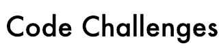

<h1 align="center"></h1>
<h4 align="center">A collection of completed code challenges for Nathan Thomas</h4>
 

## Table of Contents

- [Codewars](src/codewars/)

  - [7 kyu](src/codewars/7-kyu)
    - [Descending Order](src/codewars/7-kyu/descending-order)
    - [Exes and Ohs](src/codewars/7-kyu/exes-and-ohs)
    - [Sum of Numbers](src/codewars/7-kyu/sum-of-numbers)
    - [Vowel Count](src/codewars/7-kyu/vowel-count)
    - [You're a Square!](src/codewars/7-kyu/you're-a-square)
  - [6 kyu](src/codewars/6-kyu)
    - [Find the Parity Outlier](src/codewars/6-kyu/find-the-parity-outlier)

- [Lambda School](src/lambda-school/)

  - [Week 1](src/lambda-school/week-1)
    - [Longest String](src/lambda-school/week-1/longest-string)
    - [Reverse Number](src/lambda-school/week-1/reverse-number)
    - [Reverse String](src/lambda-school/week-1/reverse-string)
  - [Week 2](src/lambda-school/week-2)
    - [Reverse Case](src/lambda-school/week-2/reverse-case)
    - [Sort String](src/lambda-school/week-2/sort-string)
    - [String to Camel Case](src/lambda-school/week-2/string-to-camel-case)
  - [Week 3](src/lambda-school/week-3)
  - [Week 4](src/lambda-school/week-4)
  - [Week 5](src/lambda-school/week-5)
  - [Week 6](src/lambda-school/week-6)
  - [Week 7](src/lambda-school/week-7)

## Built With

- My solutions use [Javascript](https://www.ecma-international.org/ecma-262/6.0/) for the code and [Jest](https://jestjs.io/en/) for unit testing

## Authors

- [**Nathan Thomas**](https://github.com/nwthomas)

## Acknowledgments

- Thanks to [Frank Faustino](https://github.com/frankfaustino) for inspiring me to create my own completed code challenges repository.
